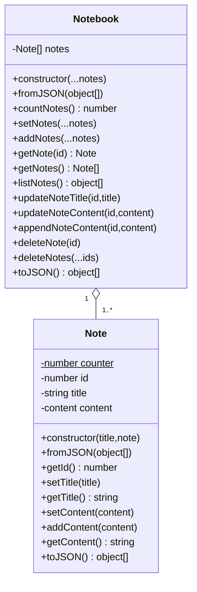

# Note Taker

Homework Challenge 11, Due January 5, 2023

## Express.js Challenge: Note Taker

Your challenge is to create an application called Note Taker that can be used to write and save notes. This application will use an Express.js back end and will save and retrieve note data from a JSON file.

The application’s front end has already been created. It's your job to build the back end, connect the two, and then deploy the entire application to Heroku.

## User Story

```text
AS A small business owner
I WANT to be able to write and save notes
SO THAT I can organize my thoughts and keep track of tasks I need to complete
```

## Acceptance Criteria

```text
GIVEN a note-taking application
WHEN I open the Note Taker
THEN I am presented with a landing page with a link to a notes page
WHEN I click on the link to the notes page
THEN I am presented with a page with existing notes listed in the left-hand column, plus empty fields to enter a new note title and the note’s text in the right-hand column
WHEN I enter a new note title and the note’s text
THEN a Save icon appears in the navigation at the top of the page
WHEN I click on the Save icon
THEN the new note I have entered is saved and appears in the left-hand column with the other existing notes
WHEN I click on an existing note in the list in the left-hand column
THEN that note appears in the right-hand column
WHEN I click on the Write icon in the navigation at the top of the page
THEN I am presented with empty fields to enter a new note title and the note’s text in the right-hand column
```

## TODO List

- [x] The application should have a `db.json` file on the back end that will be used to store and retrieve notes using the `fs` module.
- [x] The following HTML routes should be created
  - [x] `GET /notes` should return the `notes.html` file
  - [x] `GET *` should return the `index.html` file
    - This is wrong! `GET /` should return `index.html`. `Get *` (which should be defined after all the other routes) should return a catch-all Error.
- [x] The following API routes should be created
  - [x] `GET /api/notes` should read the `db.json` file and return all saved notes as JSON.
  - [x] `POST /api/notes` should receive a new note to save on the request body, add it to the `db.json` file, then return the new note to the client. You'll need to find a way to give each note a unique id when it's saved. (The project suggest looking for packages on `npm` that can do it, but I don't think I'll need that.)
    - More than likely, do what I did in the `team-profile-generator` and *statically* number notes.
- [x] Bonus: You haven’t learned how to handle DELETE requests, but this application has that functionality in the front end. As a bonus, see if you can add the DELETE route to the application using the following guideline
  - [x] `DELETE /api/notes/:id` should receive a query parameter `:id` containing the ID of a note to delete. In order to delete a note, you'll need to read all notes from the `db.json` file, remove the note with the given `id` property, then rewrite the notes to the `db.json` file.
    - Again, this sounds like something I did in the previous project. It shouldn't be too hard to write.
- [ ] Technical Acceptance Criteria
  - [ ] Application front end must connect to an Express.js back end.
  - [ ] Application back end must store notes with unique IDs in a JSON file.
  - [ ] Application must be deployed to Heroku
- [ ] Deployment
  - [ ] Application deployed at live URL
  - [ ] Application loads without errors
  - [ ] Application Github URL submitted
  - [ ] Github repo contains application code
- [ ] Application Quality: Application console is free of errors.
- [ ] Repository Quality
  - [ ] Repo has a unique name.
  - [ ] Repo follows best practices for file structure and naming conventions.
  - [ ] Repo follows best practices for class/id naming conventions, indentations, quality comments, etc.
  - [ ] Repo contains multiple descriptive commit messages.
  - [ ] Repo contains quality README file with
    - [ ] Description
    - [ ] Screenshot
    - [ ] Link to the deployed application
- [ ] Submission
  - [ ] URL with the functional, deployed application
  - [ ] URL of the Github Repo with README describing the project

## Plan of attack

- We need to number our notes statically.
- A `Notebook` is an aggregation of `Note`s
- Wishlist: `Binder` could be an aggregation of `Notebook`s. Maybe if we had time. It would require `Notebook`s to also be numbered...and maybe have other features like a subject and/or description.
- Refresh my knowledge on routes. (It might have a different diagram)
- Wishlist: Add timestamps to notes. Typically when it was last updated. Although we could also list when it was created.



## Things to note

- `public/index.html` appears to be more splash page than functional. The real action takes place at `/notes` which is supposed to go to the `public/notes.html` file?
- I added a `routes/routes.js` file to have Express do some routing.
- I added a `errors/404.html` file to handle dealing with wrong paths.  Wish I could figure out the mechanisms to create other error pages.
